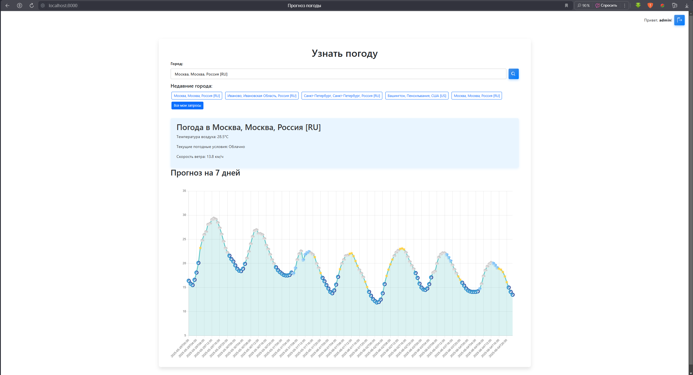
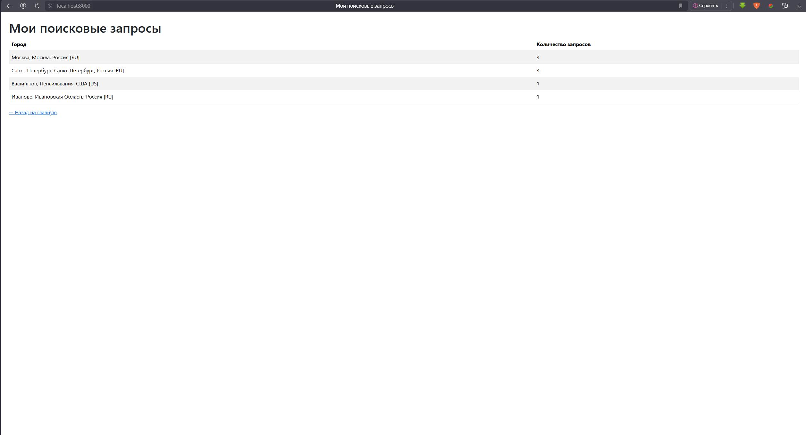
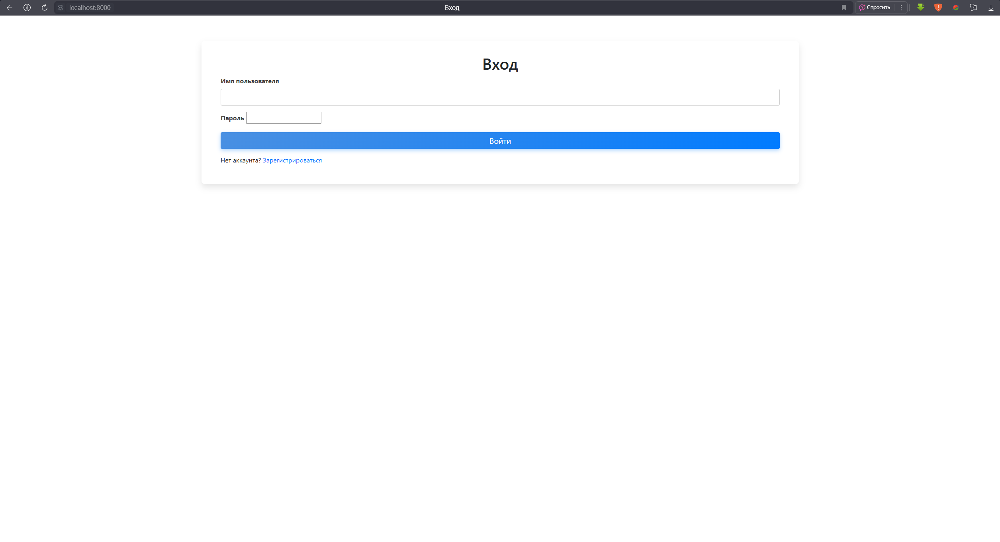
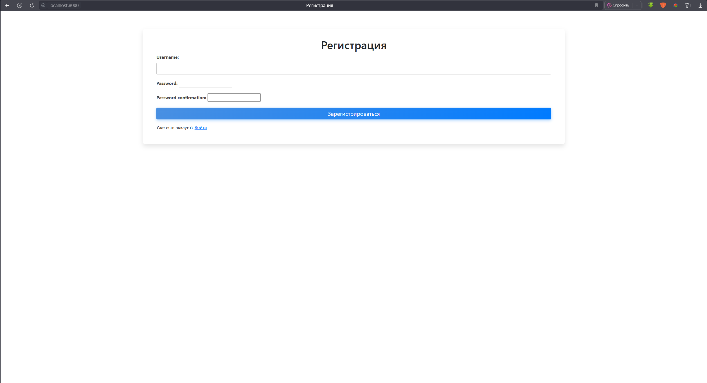
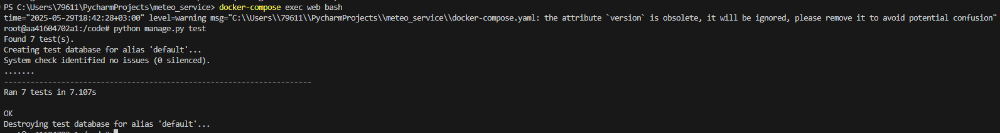

# Weather Web Application

## О проекте

Это веб-приложение для прогноза погоды, реализованное на Django. Пользователь может вводить название города и получать текущий погоду и прогноз погоды на 7 дней. Также приложение сохраняет историю последних запросов пользователя и отображает статистику по сделанным запросам.

---






## Формулировка задач
### Тестовое задание Python Developer

Сделать web приложение, оно же сайт, где пользователь вводит название города, и получает прогноз погоды в этом городе на ближайшее время.

 - Вывод данных (прогноза погоды) должен быть в удобно читаемом формате. 

 - Веб фреймворк можно использовать любой.

 - api для погоды:* https://open-meteo.com/ *(можно использовать какое-нибудь другое, если вам удобнее)*

будет плюсом если:

- написаны тесты ✅
- всё это помещено в докер контейнер ✅
- сделаны автодополнение (подсказки) при вводе города ✅
- при повторном посещении сайта будет предложено посмотреть погоду в городе, в котором пользователь уже смотрел ранее ✅
- будет сохраняться история поиска для каждого пользователя, и будет API, показывающее сколько раз вводили какой город ✅

## Как склонировать и запустить проект

```bash
git clone https://github.com/narroworb/meteo_service.git
cd /meteo_service
docker-compose build
docker-compose up
```

## Стек технологий

- Python 3.10+ — основной язык программирования.
- Django — веб-фреймворк для создания серверной части.
- PostgreSQL — реляционная база данных для хранения данных пользователей и истории запросов.
- Docker — контейнеризация проекта.
- HTML, CSS, JavaScript - фронтенд-часть приложения.
- Bootstrap 5 — фронтенд библиотека для стилизации интерфейса.
- Chart.js — библиотека для визуализации статистики (графики).
- JWT + bcrypt — для аутентификации пользователей и безопасности.

## Источники данных

Для получения данных о погоде использовалось предложенное в задании API: https://open-meteo.com/. Формат входных данных для взаимодействия с ним требует указания широты и долготы географической точки, а не названия города, поэтому необходимо было перевести название города в координаты. Для этого использовалось API с того же сайта https://geocoding-api.open-meteo.com/. Оно же использовалось для реализации автоматического дополнения текста, вводимого пользователем.

## Основные функции

#### `index(request)`

Функция index(request) — это основной обработчик главной страницы веб-приложения. Она принимает HTTP-запрос пользователя, обрабатывает введённое название города, получает прогноз погоды, а затем возвращает сгенерированную HTML-страницу с результатами.

### Основные задачи функции 

1. **Получение данных из запроса:**
   Считывает название города, введённое пользователем через форму.

2. **Валидация и обработка ввода:**
   Проверяет корректность введённого города и обрабатывает ошибки, если город не найден или введён неверно.

3. **Запрос прогноза погоды:**
   Вызывает внутренний сервис или API для получения актуальных данных о погоде для указанного города.

4. **Сохранение истории запроса:**
   Если пользователь авторизован, сохраняет данные запроса (город, время) в базе данных для дальнейшего отображения последних запросов и статистики.

5. **Формирование контекста для шаблона:**
   Формирует словарь с данными о погоде, ошибками и статистикой, которые будут отображены на странице.

6. **Рендеринг HTML-страницы:**
   Возвращает ответ с отрендеренным HTML-шаблоном, включая результаты прогноза, сообщения об ошибках и статистические данные.

```python
@login_required(login_url='login')
def index(request):
    cur_weather_data = None
    fut_weather_data = None
    error = None
    weather_forecast = None

    city = request.GET.get("city")
    if city:
        result = context.get_weather(city)

        if "error" in result:
            error = result["error"]
        else:
            cur_weather_data = result.get("current_weather", {})
            fut_weather_data = result.get("hourly", {})

            weather_forecast = {
                "dates": fut_weather_data['time'],
                "temperatures": fut_weather_data['temperature_2m'],
                "icons": [get_icon_name(code) for code in fut_weather_data["weather_code"]]
            }
            
            user = request.user if request.user.is_authenticated else None
            CitySearch.objects.create(user=user, city_name=city)

    user = request.user if request.user.is_authenticated else None
    last_cities = CitySearch.objects.filter(user=user).values('city_name').distinct()[:5]

    return render(request, "weather/index.html", {
        "weather": cur_weather_data,
        "error": error,
        "city": city,
        "weather_forecast": weather_forecast,
        "last_cities": last_cities
    })
```

#### `autocomplete_city(request)`

Функция autocomplete_city(request) обрабатывает AJAX-запросы автозаполнения поля ввода города. Она получает частичное название города из запроса, ищет подходящие совпадения и возвращает их в формате JSON для динамического отображения подсказок в интерфейсе пользователя.

### Основные задачи функции

1. **Получение данных из запроса:**
   Извлекает строку с частичным названием города, введённую пользователем.

2. **Поиск подходящих городов:**
   Выполняет поиск среди базы данных или списка городов по введённому префиксу.

3. **Формирование списка подсказок:**
   Создаёт список подходящих городов, соответствующих введённой части названия.

4. **Возврат результата в формате JSON:**
   Отправляет обратно клиенту JSON-ответ со списком городов для отображения автозаполнения.

```python
def autocomplete_city(request):
    query = request.GET.get("q", "")

    results = context.autocomplete(query)

    return JsonResponse({"results": results})
```

#### `register(request)`

Функция register(request) обрабатывает регистрацию нового пользователя. Она принимает данные из формы регистрации, валидирует их, создаёт нового пользователя в системе и перенаправляет на страницу входа.

### Основные задачи функции

1. **Обработка входящих данных:**
   Принимает данные из POST-запроса (логин, пароль и прочее).

2. **Валидация данных:**
   Проверяет корректность и полноту введённых данных (например, совпадение паролей, уникальность имени пользователя).

3. **Создание пользователя:**
   Создаёт нового пользователя в базе данных.

4. **Перенаправление:**
   При успешной регистрации перенаправляет пользователя на страницу входа или другую страницу.

5. **Отображение ошибок:**
   При ошибках регистрации (например, если имя занято) возвращает форму с сообщениями об ошибках.

```python
def register(request):
    if request.method == 'POST':
        form = UserCreationForm(request.POST)
        if form.is_valid():
            form.save()
            return redirect('login')
    else:
        form = UserCreationForm()
    return render(request, 'weather/register.html', {'form': form})
```

#### `user_search_stats(request)`

Функция user_search_stats(request) отображает статистику поисковых запросов пользователя. 

### Основные задачи функции

1. **Получение данных пользователя:**
   Определяет, какой пользователь делает запрос (из `request.user`).

2. **Извлечение статистики:**
   Извлекает из базы данных или кэша последние поисковые запросы пользователя, количество запросов.

3. **Формирование ответа:**
   Готовит данные для отображения на веб-странице (рендерит HTML-шаблон с переданными статистическими данными).

4. **Отображение:**
   Отправляет пользователю страницу с визуализацией или таблицей статистики.

```python
@login_required
def user_search_stats(request):
    stats = (
        CitySearch.objects
        .filter(user=request.user)
        .values('city_name')
        .annotate(count=Count('id'))
        .order_by('-count')
    )
    return render(request, 'weather/user_search_stats.html', {'stats': stats})
```


## Тесты

### Класс `WeatherViewsTests`

* **`test_index_renders_form_and_last_cities`**
  Проверяет, что главная страница (index) корректно отображает форму для ввода города и показывает последние поиски пользователя.

* **`test_index_with_city_query_and_weather`**
  Проверяет, что при запросе с именем города возвращается страница с корректным значением города в форме, а также с данными о погоде и прогнозе (если они есть).

* **`test_index_with_invalid_city_shows_error`**
  Проверяет, что при пустом или несуществующем названии города отображается сообщение об ошибке ("Город не найден").

* **`test_last_cities_links`**
  Проверяет, что на главной странице ссылки на последние запросы пользователя корректно сформированы и ведут к нужному городу.

* **`test_user_search_stats_authenticated`**
  Проверяет, что аутентифицированный пользователь может увидеть статистику своих поисков по городам с правильным подсчетом количества запросов.

* **`test_user_search_stats_not_authenticated`**
  Проверяет, что неаутентифицированный пользователь при попытке получить статистику перенаправляется на страницу входа.

---

### Класс `CitySearchModelTests`

* **`test_create_city_search`**
  Проверяет, что объект CitySearch корректно создаётся с правильным пользователем, названием города и проставленной датой/временем поиска.

Результаты тестов:
<p align="center">
  
</p>

## Контейнеризация с Docker

Заключительным этапом в создании WEB-приложения была контейнеризация проекта с помощью docker.
Для этого были написаны _**Dockerfile**_ и _**docker-compose.yml**_

#### 1. `Dockerfile`

```Dockerfile
FROM python:3.11-slim


ENV PYTHONDONTWRITEBYTECODE 1
ENV PYTHONUNBUFFERED 1

WORKDIR /code

COPY requirements.txt .
RUN pip install --no-cache-dir -r requirements.txt

COPY . . 
```

#### 2. `docker-compose.yml`

```yaml
version: '3.9'

services:
  web:
    build: .
    command: python manage.py runserver 0.0.0.0:8000
    volumes:
      - .:/code
    ports:
      - "8000:8000"
    depends_on:
      - db
    environment:
      - POSTGRES_DB=weather
      - POSTGRES_USER=weatheruser
      - POSTGRES_PASSWORD=weatherpass
      - POSTGRES_HOST=db

  db:
    image: postgres:15
    environment:
      POSTGRES_DB: weather
      POSTGRES_USER: weatheruser
      POSTGRES_PASSWORD: weatherpass
    volumes:
      - postgres_data:/var/lib/postgresql/data/

volumes:
  postgres_data:
```